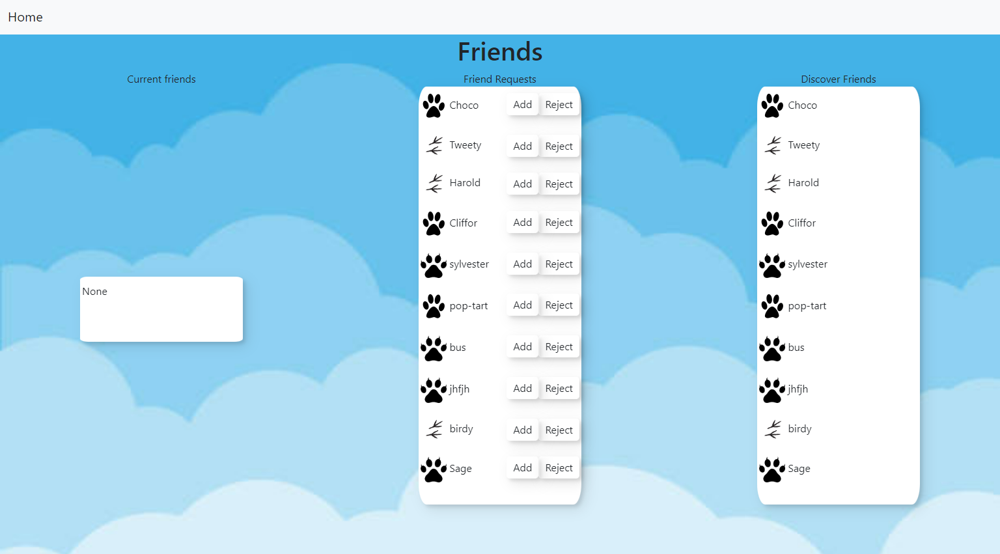

# Social Media for you and your pets

This project serves as a social media site for an owner and their pets.

# Preview

## Dashboard

## Friends

## Register

## Register your pets

# ERD Model

# How to use
1. clone repository
2. have flask installed as well as pipenv.
3. "pipenv shell" to start shell
4. "py server.py" to start application